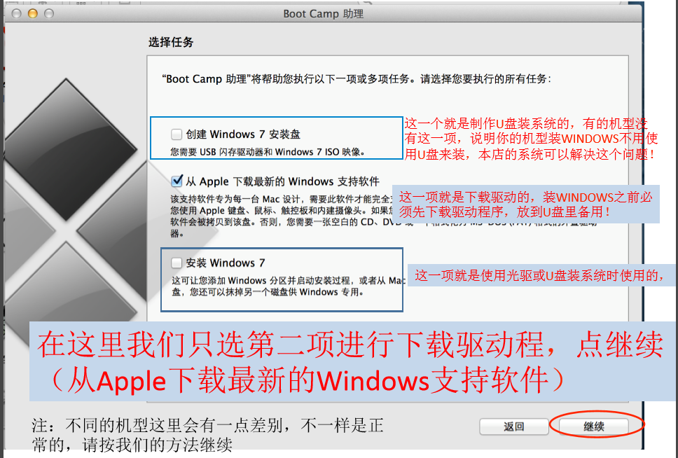

对于习惯使用windows的用户来说，希望在mac上安装windows双系统，下面就介绍我在帮以为老师安装双系统的时候遇到的问题和解决办法。

<!--more-->

```
1. 错误的尝试
2. 正确的方案
```

### 错误的尝试
> **背景**
> 1. 2011年的mac pro，系统是10.9.7。在尝试使用Boot Camp失败很多次之后。
> 2. 下载了传说中的"windows7 64位旗舰版.dmg"
> 3. 下载[苹果双系统指南]


### 正确的方案
> **winclone+win7.dmg**
> 1. 首先在mac中安装winclone，并将winclone拖到应用程序中。
> 2. 下载了[windows7.dmg(https://pan.baidu.com/s/1pKEf2Q3)。
> 3. 打开BootCamp，只选中从Apple下载最新的window支持软件，存到U盘中，下面会用到。
> 4. 分区，打开硬盘工具，选中mac分区，点击“+”，设置文件格式为“FAT”。![logo][2]
> 5. 打开winclone，再打开window7.dmg文件，此时winclone左多出一个选项，选中他恢复到3中分出的windows分区，回复镜像。
> ![logo][3]
> 6. 恢复之后重新启动window系统，系统进入自动安装状态，可能会重启多次，每次都要选取从windows启动，当系统启动完成后，接下来安装U盘中下载的windows驱动程序：
> ![logo][4]
> 7. 此时设置默认启动选项，和FN的功能键，再boot camp中选中键盘，将F1-12全部按一遍，设置成功之后成功，安装你想要的软件。
> ![logo][5]

 
 ### 个人建议
 > 其实个人感觉，mac还是苹果系统好用，飞速发展的时代，我们要不断的适应新的事物，虽然你可能不是很习惯用苹果系统，但是要有一种折腾的心态，**生命不息，奋斗不止**。
 > 希望对你有帮助，这是完成的教程，感谢这位同志的教程，同时也希望大家乐与分享。
 > 
 


  [1]: Mac中安装windows/one.png
  [2]: Mac中安装windows/two.png
  [3]: Mac中安装windows/three.png
  [4]: Mac中安装windows/four.png
  [5]: Mac中安装windows/five.png
